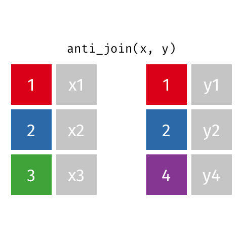

### Step 2: Select Anti Join


***

The join type that you select will determine which function ```dplyr``` will use to execute the join between the data that you selected in step 1. 

There are several joins to choose from and they all have their specific uses.

***
### Anti Join

All rows from x where there are not matching values in y, keeping just columns from x.



[Source gadenbuie GitHub](https://github.com/gadenbuie/tidyexplain)