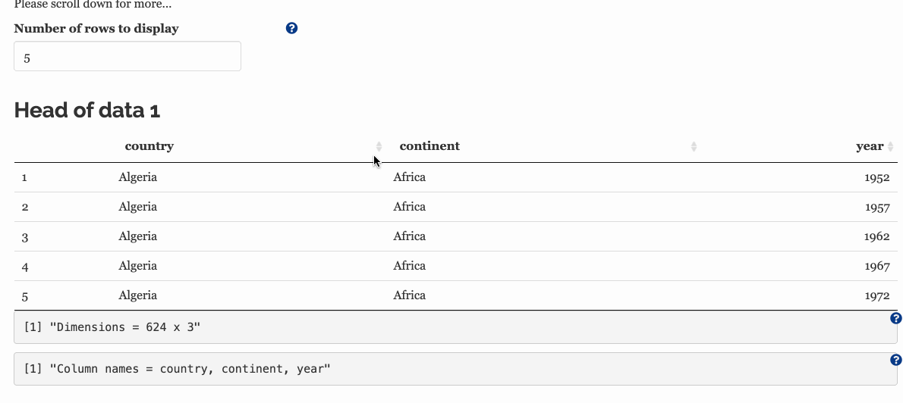

### Step 3 (optional). Select columns to join by.

***

You may select these columns by **clicking on the data tables** in the main panel to the right. You may select several columns, but it is **important that you click them in the same order for both data tables**. Try clicking on the body of the table rather than the column name, see the animation below for help.





It is important when executing a join to specify which column(s) to perform the join upon. These selected columns are typically referred to as the *keys*.

If you do not specify which columns to use as the keys, dplyr functions will execute a **'natural join'** - using all columns with common names across both dataframes.

The key column values are used to match rows from the left hand side to the right hand side. ```dplyr``` functions are flexible enough for you to join columns from each side with different column names, but you must specify this with the argument ```by = c("a" = "b", "c" = "d") will match x$a to y$b and x$c to y$d``` [Source: R documentation](https://www.rdocumentation.org/packages/dplyr/versions/0.7.8/topics/join).

It is better to ensure that the key columns on both side of the join have the same data type (eg factors or character, integer or float). In some instances, ```dplyr``` join functions will coerce and throw a warning and in others an error will be thrown.

