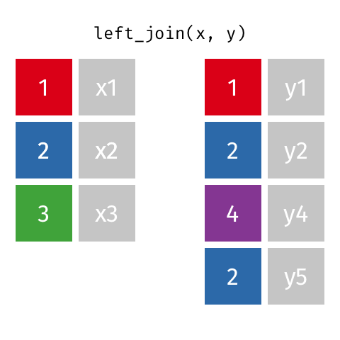

### Step 2: Selected Left Join


***

The join type that you select will determine which function ```dplyr``` will use to execute the join between the data that you selected in step 1. 

There are several joins to choose from and they all have their specific uses.

***
### Left Join

All rows from x, and all columns from x and y. Rows in x with no match in y will have NA values in the new columns.


[Source gadenbuie GitHub](https://github.com/gadenbuie/tidyexplain)

***
### Left Join with extra rows in y

If there are multiple matches between x and y, all combinations of the matches are returned.



[Source gadenbuie GitHub](https://github.com/gadenbuie/tidyexplain)